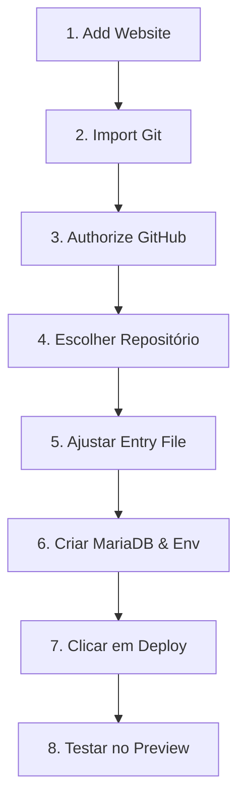

# 🚀 PROTOCOLO DE INSTALAÇÃO RÁPIDA: ARQUÊ GESTÃO NO HOSTINGER CLOUD

Este protocolo foi estruturado com base no **fluxo simplificado e nativo da Hostinger Cloud (hPanel)** para hospedagem gerenciada de aplicações Node.js. 

Siga os **8 passos simplificados** abaixo para colocar a plataforma **ARQUÊ GESTÃO** no ar de forma rápida e eficiente.

---

## 📊 Fluxo de Trabalho Simplificado

---

## 🛠️ Passo a Passo de Deploy (8 Etapas)

### Passo 1: Iniciar o Assistente
1. Acesse o seu **hPanel da Hostinger**.
2. No menu superior ou lateral, navegue até:
   👉 **Websites** ➔ **Add Website** ➔ selecione **Node.js Apps**.

### Passo 2: Selecionar o Método de Entrada
1. Na tela de importação, escolha a opção:
   👉 **Import Git Repository** *(Importar Repositório Git)*.

### Passo 3: Conectar a sua Conta GitHub
1. Clique no botão **Authorize** (Autorizar).
2. Siga a janela de autenticação segura para conectar sua conta do GitHub à Hostinger. Isso permite a sincronização em tempo real e deploys automáticos ao enviar atualizações (`git push`).

### Passo 4: Selecionar o Repositório do App
1. Escolha o repositório correto da aplicação: **ARQUÊ GESTÃO**.
2. Defina a branch de produção (geralmente `main` ou `master`).

### Passo 5: Configurar o Build (Aplicações Customizadas)
Como este aplicativo é customizado (Express.js puro com EJS), ajuste os campos de inicialização no painel:
* 🔹 **Entry File (Arquivo de Entrada):** Defina como `server.js`
* 🔹 **Output Directory (Diretório de Saída):** Geralmente deixado como `/` (diretório raiz do repositório) ou `/public_html`.
* 🔹 **Node Version:** Selecione a versão recomendada (ex: `20.x` ou `18.x`).

### Passo 6: Provisionar MariaDB & Variáveis de Ambiente
1. **Criar o Banco:** 
   * Em uma nova aba do hPanel, vá para **Bancos de Dados** ➔ **Bancos de Dados MySQL/MariaDB**.
   * Crie um novo banco de dados (ex: `u123456789_arque`), usuário e defina uma senha segura.
2. **Definir Variáveis:**
   * De volta à tela de configuração do Node.js App no hPanel, localize o campo de **Environment Variables** (Variáveis de Ambiente) e adicione as seguintes chaves com os dados que você acabou de criar:

| Nome da Variável | Valor a Inserir |
| :--- | :--- |
| `DB_HOST` | `127.0.0.1` ou o Host fornecido no hPanel |
| `DB_NAME` | Nome do banco criado (ex: `u123456789_arque`) |
| `DB_USER` | Nome do usuário criado (ex: `u123456789_arque_user`) |
| `DB_PASS` | A senha segura que você definiu para o banco |
| `JWT_SECRET` | Uma chave aleatória e segura (ex: `arque_gestao_secret_2026`) |
| `WHATSAPP_DEFAULT` | `5511999999999` (seu número padrão com DDI e DDD) |

> [!NOTE]
> Não é necessário rodar scripts manuais para criar as tabelas! O aplicativo **ARQUÊ GESTÃO** possui um sistema inteligente de auto-provisionamento em seu arquivo principal [server.js](file:///c:/Users/krsvm/OneDrive/Desktop/E-TODAVIA/SITES%20DO%20SHOWCASE/SITES%20INTITUCIONAIS/ARQUÊ%20GESTÃO/server.js#L26-L264). Assim que a aplicação iniciar no Passo 7, ele criará todas as tabelas e inserirá os dados iniciais do CMS automaticamente.

### Passo 7: Realizar o Deploy
1. Revise todos os campos de configuração e as variáveis de ambiente.
2. Clique no botão **Deploy**.
3. A Hostinger irá puxar os arquivos do GitHub, instalar as dependências de produção do [package.json](file:///c:/Users/krsvm/OneDrive/Desktop/E-TODAVIA/SITES%20DO%20SHOWCASE/SITES%20INTITUCIONAIS/ARQUÊ%20GESTÃO/package.json) com `npm install` e iniciar o processo automaticamente.

### Passo 8: Testar a Aplicação
1. Aguarde o status do deploy mudar para **Ativo/Running**.
2. Clique no link de **Preview** ou digite o seu domínio principal no navegador para testar a aplicação ativa.

---

## 🔑 Dados de Acesso ao Painel Admin do Site

Assim que o deploy for concluído com sucesso, o sistema já estará com os bancos de dados preenchidos. Você poderá acessar a área administrativa para personalizar o site usando os seguintes acessos criados automaticamente pelo provisionador:

### 1. Conta Super Administrador (Acesso Total)
* 📍 **URL:** `https://seu-dominio.com/admin/login`
* ✉️ **E-mail:** `superadmin@etodavia.com`
* 🔑 **Senha padrão:** `ET.2026*`
* ⚙️ *Permite alterar cores, pixels, cabeçalhos, rodapés e menus estruturais.*

### 2. Conta Administrador (Gestão de Conteúdo)
* 📍 **URL:** `https://seu-dominio.com/admin/login`
* ✉️ **E-mail:** `admin@arquegestao.com`
* 🔑 **Senha padrão:** `Arque.2026*`
* ⚙️ *Permite moderar depoimentos, adicionar artigos no blog, equipe e especialidades.*

---

*Elaborado para a equipe **E-TODAVIA AGÊNCIA CRIATIVA** para simplificar o seu pipeline de deploy.*
